# Tutorial: the PRISMT app

This walk-through uses the demo data first, because its answer is known, and then your
own recordings. It takes about 20 minutes, plus the one-time set-up. No knowledge of
Python, GPUs or transformers is needed.

Open the app by double-clicking `run_prismt_gui.m` in MATLAB (or typing `run_prismt_gui`
in the PRISMT folder). The six tabs are numbered in the order you use them.

## 1. Setup (once per computer)

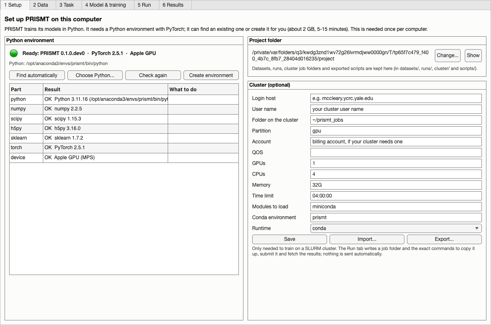

PRISMT trains its models in Python. The **Setup** tab finds or creates a suitable Python
environment:

- **Find automatically** looks for an environment that already has PRISMT's packages.
- **Create environment** makes one (about 2 GB, 5–15 minutes). It uses conda if it is
  installed; otherwise it offers to download micromamba, a single program from
  github.com/mamba-org, into PRISMT's own folder. No administrator rights are needed, and
  the window stays usable while it installs.
- **Choose Python...** uses an environment you pick yourself.

When the lamp is green, the line next to it says which device training will use: an NVIDIA
GPU, the Apple GPU, or the CPU (slower, but fine for the demo and for small datasets).

The **project folder** (default `Documents/PRISMT`) holds everything PRISMT writes:
`datasets/`, `runs/`, `cluster/` job folders and exported `scripts/`. The cluster panel is
only needed for [training on a cluster](cluster.md).

## 2. Data

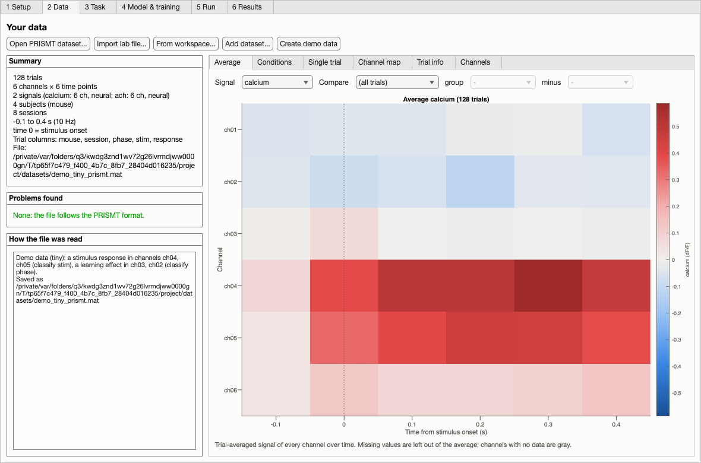

Press **Create demo data**. The demo imitates a two-colour widefield experiment: `calcium`
and `ach` recorded on a small grid of cortical channels, trials aligned to a stimulus (CS+
or CS−), eight mice, early and late learning sessions. Two things are planted, so you can
check that PRISMT finds them:

- on CS+ trials, two bottom-left channels respond (classify `stim` to find it);
- in late sessions, two top-right channels show an ACh response (classify `phase`).

The **Summary** lists trials, channels, time points, signals, subjects and sessions, and
**Problems found** lists anything wrong with the file. The previews show the data before
any model is trained:

| Preview | Use it to check |
|---|---|
| Average | The trial-averaged signal of every channel. *Compare* shows the difference between two groups of trials (e.g. late minus early). |
| Conditions | Mean ± SEM over time for chosen channels, one line per condition (SEM across subjects). |
| Single trial | One trial at a time, with its trial information. |
| Channel map | One value per channel on the atlas or channel positions: the average signal, or how much data is missing. |
| Trial info | Trial counts for two columns (e.g. phase × mouse). Empty cells mean a condition is missing in some subjects; see [pitfalls](results-and-pitfalls.md#confounds). |
| Channels | Every channel, the signals it has, how much is missing, and its **group**. Type groups (brain area, left/right, sensor, body part) and press *Save groups*; the Task tab can then use some groups only. |

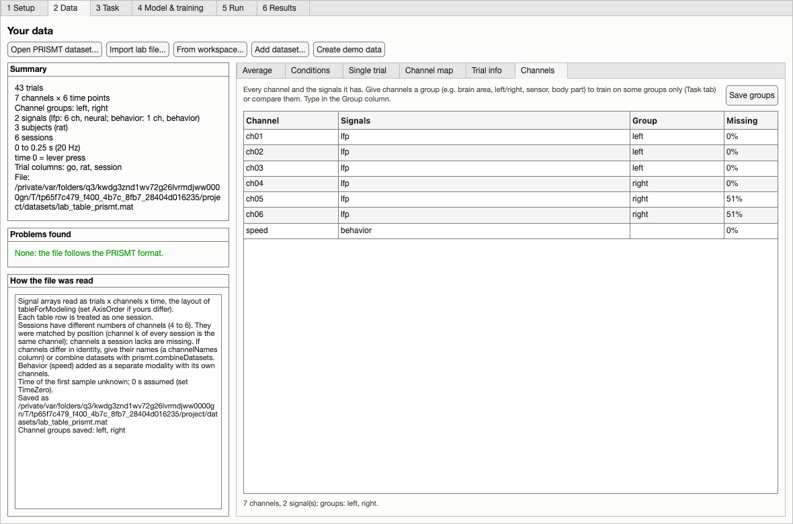

**Your own data.** *Import lab file...* reads the lab's `tableForModeling` tables (one row
per session, with a `meta` struct), `processed_data` / `standardized_data` structs,
numbered-variable files and CDKL5 continuous recordings. It first shows what the file
contains and lets you choose how to read it:

| Option | Use it for |
|---|---|
| Signal | Which recorded variable(s) to use; several become separate signals. |
| Channels | *Each is one channel*, or split the channels into K signals *in blocks* (1..R/K, next R/K, ...) or *alternating* (1, K+1, ... / 2, K+2, ...), e.g. two indicators recorded on the same regions. |
| Signal names, kind, units | E.g. `calcium, ach`, kind `neural`; for non-brain signals `physiology`, `behavior`, `stimulus` or any text. |
| Behavior | Per-trial time series (running speed, licking, pupil...) added as a separate signal with its own channels. |
| Subject column, timing | Which column identifies subjects; sampling rate, time of the first sample and what time 0 is, when the file does not say. |

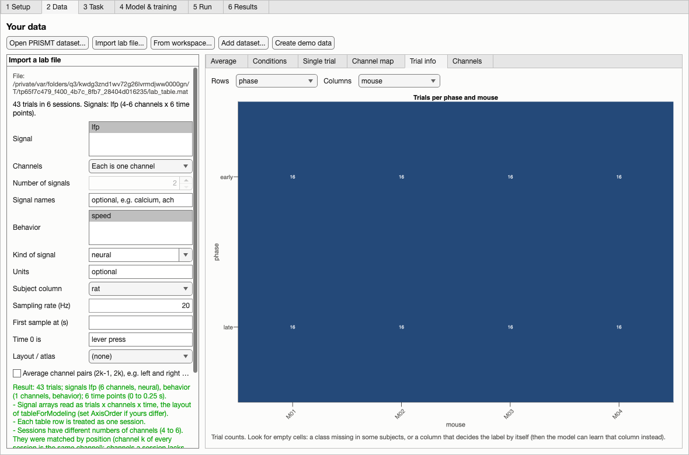

*Preview* reads the file with these options and says how it was read; *Save and use* saves
it as a PRISMT dataset. Sessions with different numbers of channels are accepted (matched by
name when the table lists each session's channel names, otherwise by position; channels a
session lacks are missing). **Add dataset...** joins other PRISMT datasets to the open one,
matching channels and signals by name: use it for recordings with different electrodes, or to
add a signal recorded in another file. For other layouts, build the dataset in MATLAB and use
*From workspace...*:

```matlab
ds = prismt.makeDataset(X, trials, SamplingRate=10, TimeZero=-1, Subject="mouse", Session="session");
```

where `X` is trials × channels × time (× signals) and `trials` a table with one row per
trial. Any per-trial column can later be a label or a filter. See `help prismt.importData`
and `help prismt.makeDataset` for the options (signals, channel layout, behavior as an
extra signal, atlas).

## 3. Task

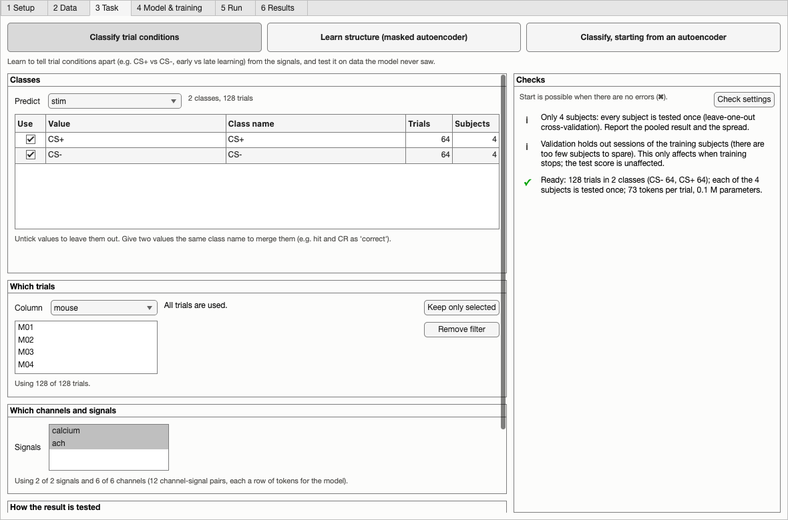

Choose what to learn with the three buttons at the top.

**Classify trial conditions.** *Predict* is the trial column to learn, e.g. `phase`. The
class table lists its values with their trial and subject counts:

- untick a value to leave it out;
- give two values the same *Class name* to merge them (e.g. `hit` and `CR` as `correct`).

**Which trials** keeps only some trials (e.g. only CS+ trials, or some mice). The line under
it says how many trials are used.

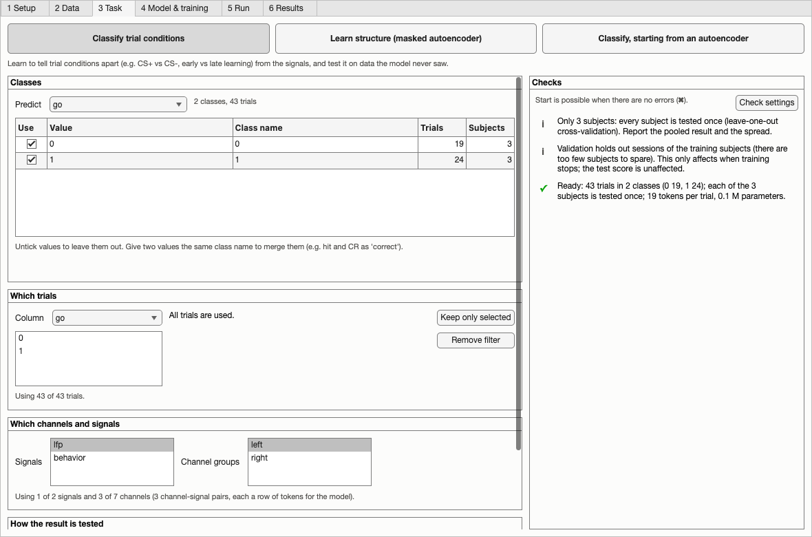

**Which channels and signals** chooses what the model sees: some signals only (e.g. the
neural signal without behavior, to ask whether it alone carries the information), and, when
the dataset has channel groups, some groups only.

**How the result is tested** decides which trials are kept aside to measure the score.
*Automatic* tests on subjects the model never saw when there are at least three, which is
what makes a result generalize, and uses cross-validation so that every subject is tested
exactly once (5 folds, or leave-one-out with 3–5 subjects); see
[why](results-and-pitfalls.md#testing-on-new-subjects).

The **Checks** list on the right says what is ready and what needs attention. Each item
says how to fix it, and *Go to setting* jumps to the right place. Press **Check settings**:
PRISMT then reports the classes, exactly how the trials will be split (for example "each
of the 8 subjects is tested once"), and the model size.

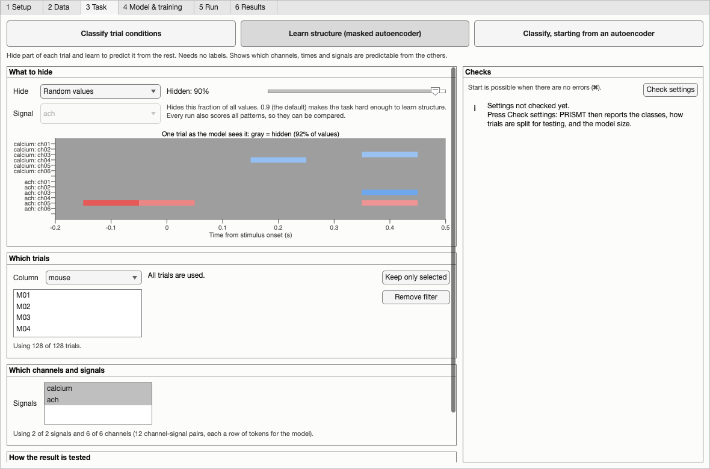

**Learn structure (masked autoencoder)** needs no labels. *Hide* chooses what the model
must predict while it learns: random values (the default hides 90%), whole channels, the
second part of each trial (forecast), or a whole signal (e.g. ACh from calcium). The picture
shows a real trial as the model sees it, with the hidden values in gray. Whatever was
chosen for training, every run is scored on all these patterns.

**Classify, starting from an autoencoder** reuses a finished autoencoder run as the starting
point of a classifier (choose it under *Start from*). It keeps the autoencoder's split, so
the test subjects stay unseen.

## 4. Model & training

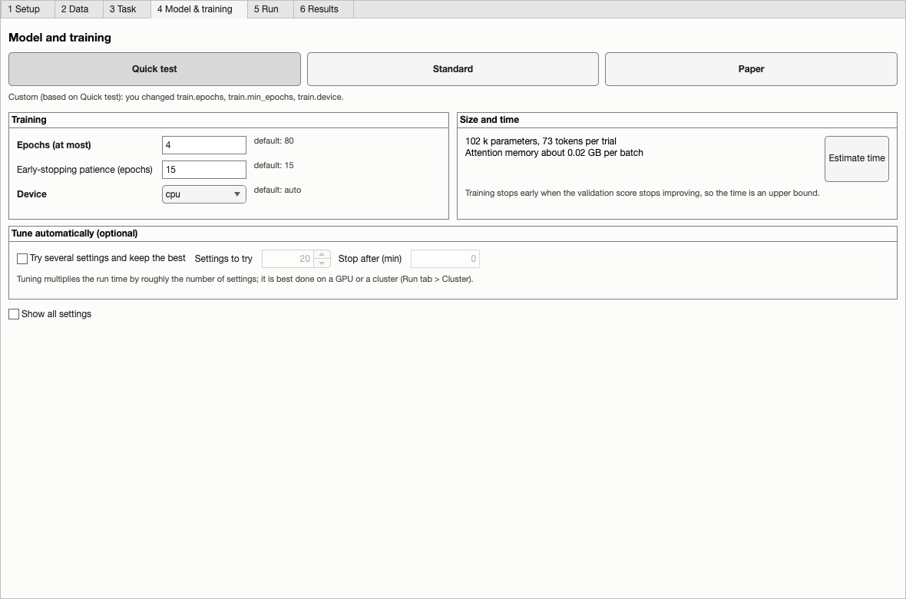

Pick a preset:

| Preset | Use it for |
|---|---|
| Quick test | Checking that everything works; minutes on a laptop. |
| Standard | Real analyses; a larger model and a longer budget. |
| Paper | The configuration of the PRISMt paper; needs a GPU or a cluster. |

**Estimate time** runs a few training steps on this computer and reports the number of
tokens per trial, the model size and an upper bound on the run time (training stops early
when the validation score stops improving).

**Tune automatically** trains many models with different settings, compares them on
validation trials only, then retrains the best with several seeds and tests it once. It
multiplies the run time by roughly the number of settings tried, so it is best done on a
cluster.

**Show all settings** lists every setting with a plain explanation (hover for more). A
setting you change is shown in bold and the preset line says "Custom (based on ...)". Leave
a field empty to use the default. The [settings reference](hyperparameters.md) lists them
all and says what to change first when a result looks wrong.

## 5. Run

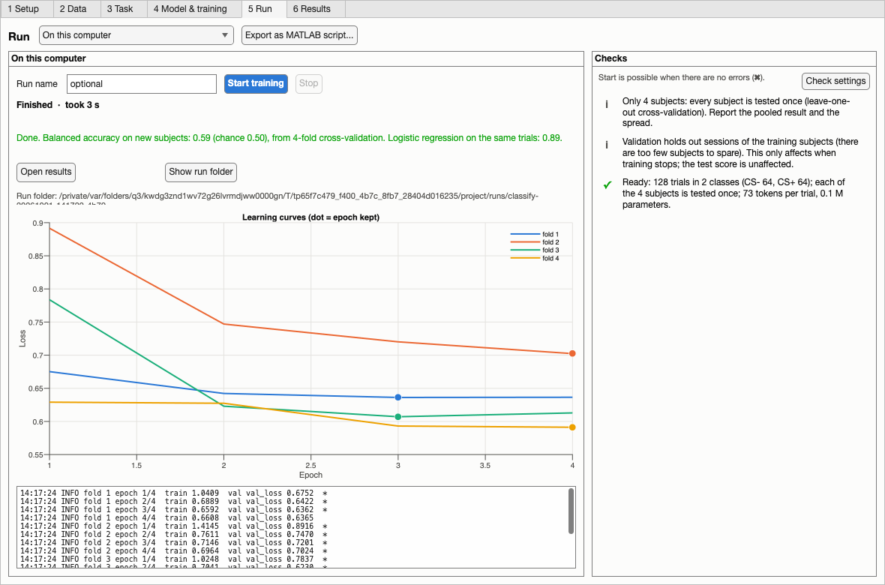

Press **Start training**. The run happens in the background in its own folder under
`runs/`; MATLAB stays usable, and closing the app or MATLAB does not stop it (reopen it from
the Results tab with **Watch**). The tab shows the progress, the learning curves (one line
per fold, a dot at the epoch that was kept) and the log.

**Stop** asks the run to stop after the current step. The best model so far is still
evaluated on the test trials, so a stopped run has results.

When the run ends, a line says what happened: the score and the reference models when it
finished, or what went wrong and what to do when it failed (*Technical details* opens the
full log).

**Export as MATLAB script...** writes a script that repeats this run without the app, for
your analysis records.

**On a cluster (SLURM)** writes a job folder and the exact commands to copy it to the
cluster, submit it and fetch the results; see [cluster.md](cluster.md).

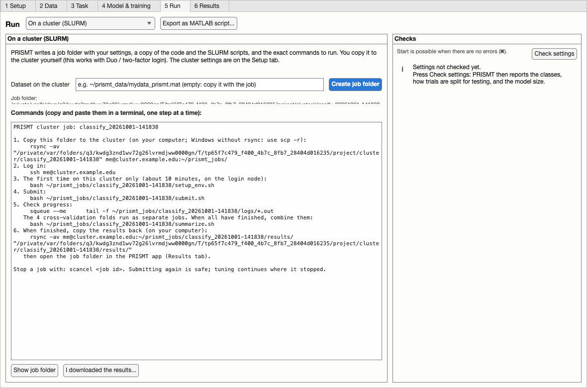

## 6. Results

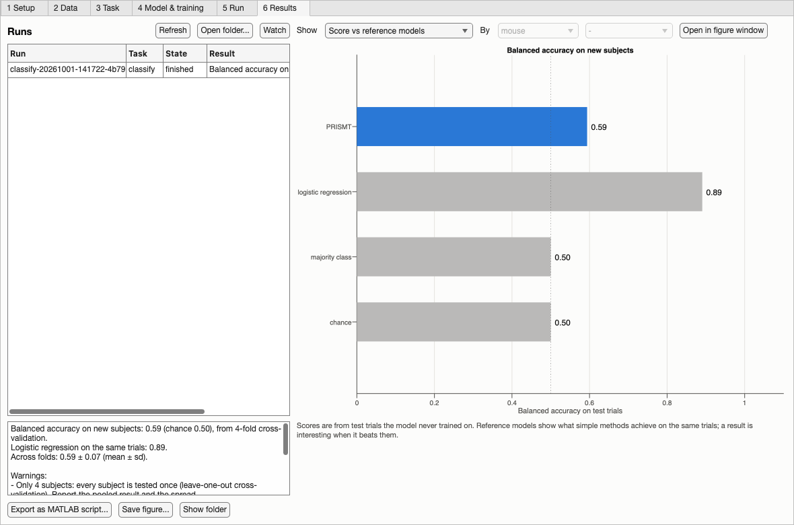

Choose a run in the list. The summary says the score on the test trials, what the
reference models achieve on the same trials, and any warnings. *Show* picks a plot:

| Classification | Masked autoencoder |
|---|---|
| Score vs reference models | Score vs reference models (R² for each hiding pattern) |
| Learning curves | Learning curves |
| Confusion matrix | Reconstruction example (original, what the model saw, reconstruction, error) |
| Accuracy per subject / per session | Predictability per channel, and the gain over the best baseline |
| Confidence (probability of the true class) | Predictability by condition (e.g. early vs late; exploratory) |
| Summary space (embedding), coloured by any trial column | Summary space (embedding) |

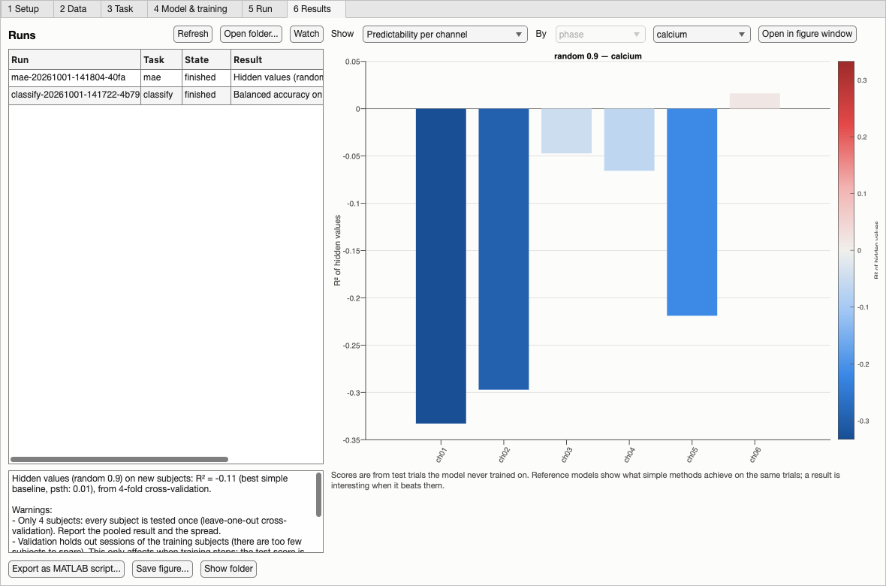

**Open in figure window** redraws the plot in a normal MATLAB figure (to zoom, edit or
save), and **Save figure...** writes it as PNG, PDF or SVG. **Export as MATLAB script...**
writes a script that reruns the analysis and draws the plots.

Before interpreting a result, read [results-and-pitfalls.md](results-and-pitfalls.md).

## Example results on the demo data

These figures come from `matlab/examples/prismt_tutorial.m` on the demo data (8 mice, 5-fold
cross-validation, Quick preset); they are what a working setup should give.

**The data.** The planted stimulus response (CS+ minus CS−, channels 9–10), the planted
learning effect (late minus early ACh, channels 3–4), condition traces, and trial counts per
mouse and phase.

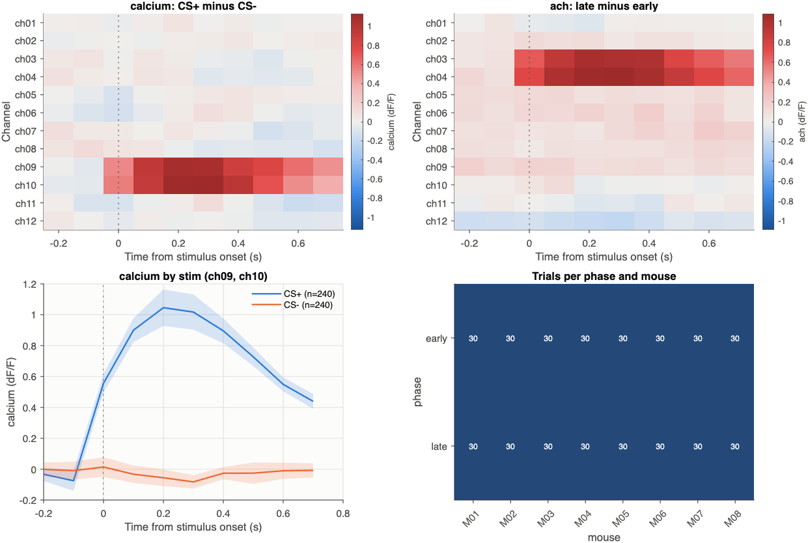

**Classifying early vs late learning.** One learning curve per fold, the confusion matrix,
the score against the reference models (0.91 balanced accuracy on new mice; logistic
regression 0.95; chance 0.50), and accuracy per mouse.

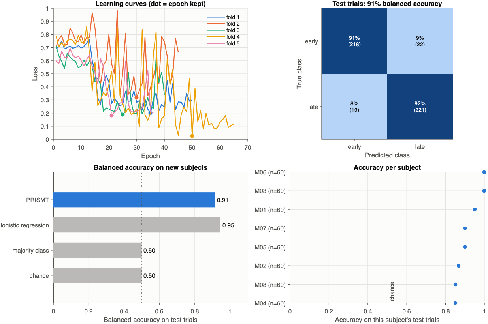

**Learning structure (masked autoencoder).** One test trial (recorded, what the model saw,
its reconstruction, the error); R² of hidden values for each hiding pattern against the best
simple baseline (the model predicts hidden values, and ACh from calcium, where the baselines
cannot; forecasting is negative because this model was trained with random hiding);
predictability per channel; and ACh predictability by learning phase.

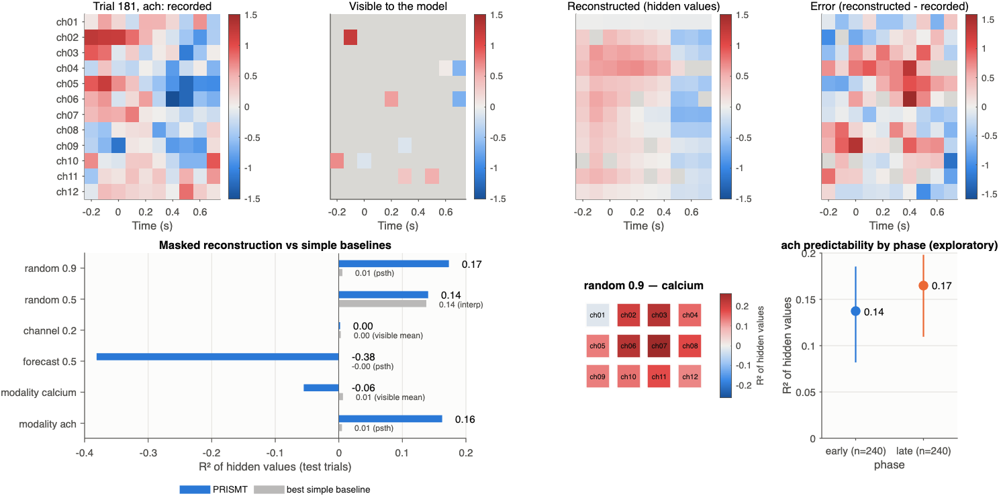

**Classifying after the autoencoder.** The fine-tuned score, and the test trials of one fold in
that fold's model summary space (each fold has its own model, so folds are shown one at a
time), coloured by learning phase.

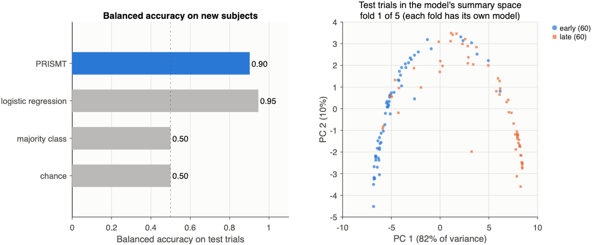

## The same without the app

`matlab/examples/prismt_tutorial.m` does all of the above from a script: demo data,
classification, masked autoencoder, fine-tuning, and figures. Every app action has a
function:

| App | Function |
|---|---|
| Create environment / Find | `prismt.env.createEnvironment`, `prismt.env.findPython` |
| Import, From workspace | `prismt.importData`, `prismt.makeDataset`, `prismt.writeDataset` |
| Task, Model & training | fields of the `cfg` struct from `prismt.defaultConfig` |
| Check settings / Estimate time | `prismt.check(cfg)`, `prismt.check(cfg, Timing=true)` |
| Start, Stop | `run = prismt.train(cfg)` (or `prismt.hpo`), `run.stop()` |
| Cluster job folder | `prismt.makeClusterJob(cfg, profile)` |
| Results | `R = prismt.loadResults(folder)`, `prismt.plot.*`, `prismt.listRuns` |
